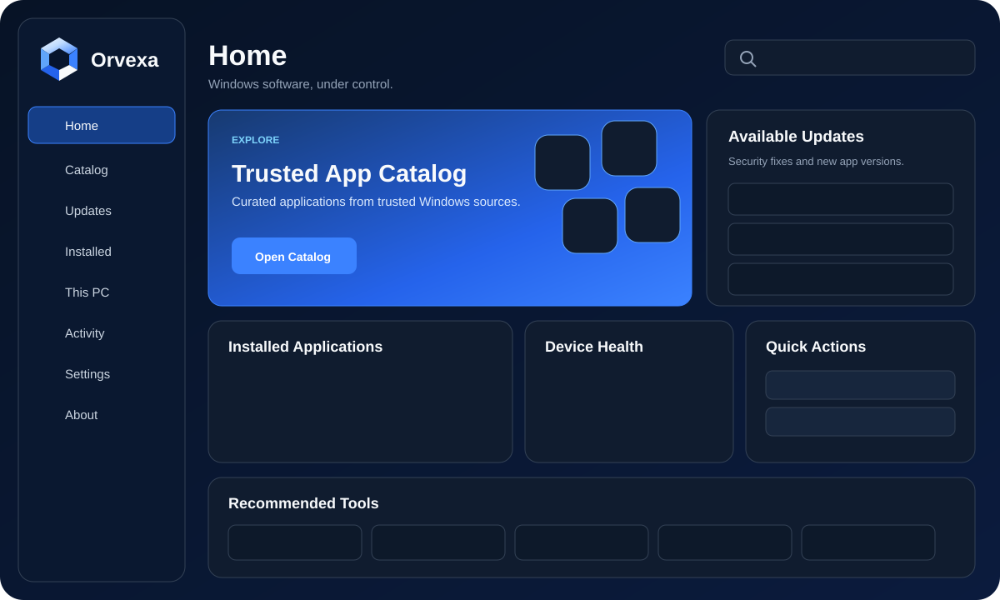

<div align="center">
  

  <h1>Windows software, under control.</h1>

  <p><strong>Discover, install, update and manage trusted Windows applications from one modern control center.</strong></p>

  <p>
    <a href="https://github.com/bren-wp/Orvexa/releases/latest"><strong>Download latest release</strong></a>
    ·
    <a href="apps/web/">Explore Orvexa Web</a>
    ·
    <a href="docs/SECURITY.md">Security</a>
    ·
    <a href="docs/PRIVACY.md">Privacy</a>
  </p>

  <a href="https://github.com/bren-wp/Orvexa/actions/workflows/ci.yml">
    
  </a>
</div>

---

<div align="center">
  
</div>

## Meet Orvexa

Orvexa is a modern Windows software control center built around a simple idea: installing and maintaining trusted Windows apps should not feel like managing a package manager.

It combines a curated application catalog, WinGet, device recommendations and local system information in one native Windows experience. The companion Orvexa Web interface lets you prepare an app selection in the browser and hand only trusted catalog IDs to the Windows application through the `orvexa://` protocol.

**Current version: 0.0.6**

<table>
  <tr>
    <td width="72" align="center"></td>
    <td><strong>Native Windows app</strong><br/>WinUI 3 · .NET 8 · Windows App SDK</td>
    <td width="72" align="center"></td>
    <td><strong>Orvexa Web</strong><br/>Responsive · local assets · curated catalog</td>
  </tr>
</table>

## What makes Orvexa different

Orvexa is designed as a product, not a thin wrapper around a package-manager command. The catalog is useful immediately, package operations stay reviewable, local state is bounded and recoverable, and the browser-to-Windows bridge never carries arbitrary shell commands.

<div align="center">
  &nbsp;&nbsp;&nbsp;
  &nbsp;&nbsp;&nbsp;
  &nbsp;&nbsp;&nbsp;
  
</div>

- **Curated first-run experience** — the trusted catalog is populated before the first search.
- **Native Windows UX** — WinUI 3, .NET 8 and Windows App SDK, with one primary application window.
- **Safe web handoff** — only validated Orvexa catalog IDs cross the `orvexa://` boundary.
- **Local-first privacy** — no telemetry transport; settings, favorites, activity and cache remain local.
- **Release-grade automation** — QA, native build, Setup, checksums and GitHub Releases are part of the release gate.

## Why Orvexa

| | Capability | What it means |
|---|---|---|
|  | **Curated catalog** | A trusted, bundled app catalog is visible immediately — no empty first-run experience. |
|  | **One-window Windows UX** | Home, Catalog, Updates, Installed, This PC, Activity, Settings and About stay inside one main app window. |
|  | **WinGet powered** | Search, install, update, uninstall and health operations use validated WinGet arguments instead of arbitrary shell commands. |
|  | **Security-first protocol** | Browser requests contain only bounded Orvexa catalog IDs. The Windows app resolves and validates them again before execution. |
|  | **Release automation** | CI validates QA and native Windows builds. Stable releases are packaged and published from GitHub automatically. |
|  | **Local-first state** | Settings, favorites, activity, cache and diagnostics remain local with bounded reads, atomic writes and recovery handling. |

## A catalog built for real Windows setups

Orvexa ships with a curated catalog covering browsers, development tools, utilities, media, communication, productivity, security, cloud tools and more.

<div align="center">
  &nbsp;&nbsp;
  &nbsp;&nbsp;
  &nbsp;&nbsp;
  &nbsp;&nbsp;
  &nbsp;&nbsp;
  &nbsp;&nbsp;
  &nbsp;&nbsp;
  &nbsp;&nbsp;
  
</div>

The catalog is deduplicated by canonical package ID, compared case-insensitively and designed for bounded local caching and incremental rendering instead of trying to display thousands of entries at once.

## Windows experience

The native Orvexa application is built with **WinUI 3, .NET 8 and Windows App SDK** — not Electron, not a WebView shell and not a legacy WinForms/WPF interface.

### Main sections

- **Home** — overview, recommendations and shortcuts
- **Catalog** — curated apps, search, favorites, multi-select and installation
- **Updates** — scan, filter, update selected or update all with confirmation
- **Installed** — local package inventory, filtering and selected uninstall
- **This PC** — WinGet status, architecture, Windows version, memory and disk health
- **Activity** — bounded local operation history
- **Settings** — theme, confirmation policy, refresh behavior and search limits
- **About** — version, licensing and product information

## Orvexa Web

Orvexa Web is the browser companion to the Windows application. It is built with static HTML, CSS and JavaScript and uses local brand and catalog assets.

It includes:

- responsive sticky navigation and mobile menu
- Windows 10 / Windows 11 selection
- categories, filters, sorting and local search
- favorites and multi-select
- curated packs
- incremental catalog rendering
- selection tray and review dialog
- Orvexa protocol handoff
- Setup fallback flow
- accessibility states, reduced-motion support and keyboard handling

## Secure install flow

```text
Browser selection
      ↓
Orvexa catalog IDs only
      ↓
orvexa://install?ids=...
      ↓
URI + action validation
      ↓
Bundled trusted catalog resolution
      ↓
Enabled WinGet entry verification
      ↓
User confirmation
      ↓
WinGet execution
```

The browser never sends an arbitrary shell command. **Orvexa 0.0.5 further hardens the web-to-Windows boundary** by rejecting oversized, ambiguous or invalid protocol requests instead of partially processing them. WinGet processes use `ProcessStartInfo.ArgumentList`, bounded output capture, cancellation, timeouts and process-tree termination where required.

Read the full model in [`docs/SECURITY.md`](docs/SECURITY.md).

## Privacy by design

Orvexa does not include a telemetry transport. Product state such as settings, favorites, activity, catalog cache, diagnostics and window state is stored locally.

Local JSON storage uses bounded reads, atomic replacement writes, unique temporary files and bounded corruption quarantine/recovery behavior.

Read [`docs/PRIVACY.md`](docs/PRIVACY.md).

## Release channels

Stable releases use:

```text
0.0.4
0.0.5
0.0.6
```

Release candidates use:

```text
0.0.5-rc.1
0.0.5-rc.2
```

Set the version from the repository root:

```bash
node tools/set-version.mjs 0.0.6
node tools/set-version.mjs 0.0.7-rc.1
```

The version tool synchronizes package metadata, .NET metadata, assembly/file version, Windows manifest, Setup configuration, web metadata/footer, build metadata and release artifact names.

## Download and release artifacts

Stable GitHub releases publish source-oriented artifacts directly from the tagged repository state:

```text
Orvexa-0.0.6.zip
Orvexa-Web-0.0.6.zip
Orvexa-QA-0.0.6.zip
```

Windows production packaging is handled separately by `installer/build-production.ps1` and produces the versioned Portable and Setup artifacts when the Windows build environment is available:

```text
Orvexa-Portable-0.0.6-x64.exe
Orvexa-Portable-0.0.6-x64.zip
Orvexa-Setup-0.0.6-x64.exe
```

> Signing certificates and private keys are never committed to the repository.

### Portable EXE

**0.0.6 fixes the Portable startup path.** The WinUI executable is now published directly with its final release filename instead of being renamed after publish, avoiding a Windows App SDK 1.8 XAML resource-resolution failure.

`Orvexa-Portable-0.0.6-x64.exe` is a **self-contained single-file Windows build**. It does not require Setup and is built from the same release source and version metadata as the installer.

The Portable EXE is included in the SHA-256 manifest and published as a first-class GitHub Release asset. **Portable startup is tested on Windows before release**; CI fails if the process exits during the startup smoke-test window.

## Build

### QA

```bash
npm run qa
```

The QA suite checks version synchronization, catalog integrity, single-window wiring, protocol safety, bounded storage, Setup configuration, web integrity, accessibility wiring, JavaScript syntax and release assumptions.

### Windows source build

```powershell
dotnet restore apps/windows/Orvexa.sln
dotnet build apps/windows/Orvexa.sln -c Release --no-restore
```

### Production Windows artifacts

```powershell
powershell -ExecutionPolicy Bypass -File installer/build-production.ps1
```

## Repository map

```text
Orvexa/
├─ apps/
│  ├─ windows/      # WinUI 3 application + reusable core
│  └─ web/          # public Orvexa Web experience
├─ build/            # version metadata + product icons
├─ docs/             # architecture, security, privacy and release docs
├─ installer/        # production build + Setup scripts
├─ qa/               # release QA suite
├─ shared/           # canonical catalog and shared metadata
└─ tools/            # version, catalog and synchronization tooling
```

## Technology

| Layer | Technology |
|---|---|
| Windows UI | WinUI 3 |
| Runtime | .NET 8 |
| Windows platform | Windows App SDK |
| Package operations | WinGet |
| Web | HTML · CSS · JavaScript |
| Setup | Inno Setup |
| QA / tooling | Node.js |
| CI | GitHub Actions |

## Project principles

1. **Stability before feature count.**
2. **One clear window instead of fragmented dialogs.**
3. **No arbitrary shell commands from the browser.**
4. **Bounded local state and resilient recovery.**
5. **Fast, responsive interfaces across desktop and mobile web.**
6. **A release is not complete until QA and GitHub CI pass.**

---

<div align="center">
  
  <br/>
  <strong>Orvexa</strong><br/>
  <sub>A modern Windows software control center.</sub><br/>
  <sub>Built and maintained by Brendigo.</sub>
</div>