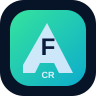
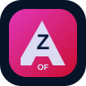

<div align="center">
  <picture>
    <source media="(prefers-color-scheme: dark)" srcset="apps/web/assets/brand/logo-dark.svg">
    <source media="(prefers-color-scheme: light)" srcset="apps/web/assets/brand/logo.svg">
    
  </picture>

  <h1>Windows software, under control.</h1>

  <p><strong>Discover, install, update and manage trusted Windows applications from one native control center.</strong></p>

  <p>
    <a href="https://github.com/bren-wp/Orvexa/releases/latest"><strong>Download latest release</strong></a>
    &nbsp; | &nbsp;
    <a href="docs/UI-DESIGN.md">UI design</a>
    &nbsp; | &nbsp;
    <a href="docs/SECURITY.md">Security</a>
    &nbsp; | &nbsp;
    <a href="docs/PRIVACY.md">Privacy</a>
  </p>

  <p>
    <a href="https://github.com/bren-wp/Orvexa/actions/workflows/ci.yml"></a>
    <a href="https://github.com/bren-wp/Orvexa/releases/latest"></a>
    
    
    
  </p>
</div>

---

<div align="center">
  
</div>

## Meet Orvexa

Orvexa is a native Windows software control center designed to make package management feel like a polished product instead of a command-line workflow. It combines a curated application catalog, Windows Package Manager, local device information, favorites, update management and bounded local activity history inside one focused WinUI 3 application.

**Current version: 0.0.11**

Version 0.0.10 keeps the approved Orvexa visual direction, keeps the 354-app curated catalog, and expands the production large-catalog layer to **10,500 WinGet-backed applications** generated from upstream WinGet metadata. The large catalog is validated for duplicate IDs, duplicate normalized names and duplicate WinGet package IDs, and every logo field includes provenance through `logoSource` and `logoStatus` instead of pretending fallback artwork is an original logo.

<table>
<tr>
<td width="50%" valign="top">

### Native Windows UI

Built with **WinUI 3, .NET 8 and Windows App SDK**. Orvexa is not Electron, not a WebView application shell, and not a legacy WinForms/WPF interface.

</td>
<td width="50%" valign="top">

### Local-first product architecture

Settings, favorites, activity, catalog cache, protocol handoff and diagnostics remain local. Package operations use explicit validated WinGet arguments.

</td>
</tr>
</table>

## The Orvexa visual system

The Windows application, website branding and this README share one visual language.

| Token | Value | Purpose |
|---|---|---|
| Primary Blue | `#3B82FF` | Primary actions, active states and selection |
| Deep Blue | `#2563EB` | Strong accents and gradients |
| Navy | `#0B1B3D` | Product background and brand depth |
| Card | `#101C2F` | Main elevated surfaces |
| Border | `#334155` | Dividers and subtle outlines |
| Muted | `#94A3B8` | Secondary text |
| Surface | `#F8FAFC` | Primary light text |
| Success | `#4ADE80` | Healthy and completed states |

The geometric six-segment Orvexa mark uses white, light-blue and deep-blue facets and appears consistently in the native shell, web assets and documentation.

Read the implementation contract in **[docs/UI-DESIGN.md](docs/UI-DESIGN.md)**.

## One shell, eight focused surfaces

The approved navigation order is fixed and covered by QA:

**Home -> Catalog -> Updates -> Installed -> This PC -> Activity -> Settings -> About**

### Home

The dashboard follows the approved composition:

- Trusted App Catalog hero
- Available Updates
- Installed Applications
- Device Health
- Quick Actions
- Recommended Tools

The hero uses the strongest brand gradient and local application artwork.

### Catalog

Catalog uses responsive native cards rather than a plain default list. Each card can display the local app icon, name, canonical package metadata, category, Windows compatibility, version and a real install action.

Presentation metadata is read from the same bounded bundled catalog used by package logic. Descriptions are not duplicated in XAML.

Version 0.0.10 ships two catalog layers:

- **354 curated applications** with local SVG artwork for the polished first-run experience.
- **10,500 large-catalog applications** generated from upstream WinGet metadata and bundled as `shared/catalog-large.json`.

The large catalog was generated from 13,883 WinGet package candidates and selected the best 10,500 records after de-duplication and logo provenance ranking. It contains **174 verified upstream logos**, **10,326 publisher/package favicon fallback logos** and **0 entries without an upstream logo source**. Fallbacks are marked as fallbacks; Orvexa does not label them as original logos.

### Updates

Updates uses the approved management layout with summary cards, search, explicit scan actions and a structured result list. Each package row shows the installed and available versions plus a real single-package Update action.

Update Selected and Update All remain confirmation-gated.

### Installed

Installed software uses a structured native list with local icons, package identity, version information, source and real uninstall actions. Destructive operations remain explicit and confirmed.

### This PC

The device page uses a large overview hero, quick actions and system/health cards. Orvexa only displays data it can actually collect safely; the application does not invent hardware values simply to imitate example mockup text.

### Activity

Activity keeps the approved summary-card feel while preserving Orvexa's bounded local activity store. Package, action, result, time and bounded detail remain local.

### Settings

Settings uses grouped cards for Appearance, Behavior, Confirmations, Catalog and Diagnostics. Only settings backed by persisted application behavior are interactive.

### About

About uses the large Orvexa brand hero followed by Version, Technologies, License, product information and Privacy/Security cards.

## 0.0.10 UI parity and catalog QA

Orvexa runs UI parity and catalog integrity checks as part of `npm run qa`.

UI parity verifies:

- the approved navigation order;
- every primary mockup surface exists in the native shell;
- Orvexa design tokens are present in WinUI resources;
- brand, app and category SVGs are linked into the native build locally;
- Catalog cards use bundled catalog presentation metadata;
- primary card actions are wired to real package operations;
- README and UI-DESIGN remain connected to the approved visual direction.

Curated catalog validation verifies:

- at least 300 curated catalog apps;
- no duplicate app IDs;
- no duplicate normalized app names;
- no duplicate normalized WinGet package IDs;
- every app has a known category;
- every app has normalized platform and architecture metadata;
- every app icon exists locally under `apps/web/assets/apps`.

Large catalog validation verifies:

- at least 10,001 WinGet-backed applications;
- no duplicate app IDs;
- no duplicate normalized app names;
- no duplicate normalized WinGet package IDs;
- HTTPS logo URLs for every non-missing logo record;
- explicit `logoSource` and `logoStatus` values;
- known category, Windows platform metadata and x64 architecture metadata for every entry;
- minimum 10,001 verified/fallback upstream logo records without fake original-logo claims;

## Real catalog artwork

Orvexa ships local SVG artwork for the curated app catalog. Native cards use that curated asset set without remote image dependencies.

The large catalog also carries upstream logo metadata for discovery quality. Entries prefer curated package-icons or WinGet `IconUrl`; when no such icon is exposed, Orvexa stores a publisher/package favicon fallback and marks it as `fallback`.

<div align="center">
  &nbsp;&nbsp;
  &nbsp;&nbsp;
  &nbsp;&nbsp;
  &nbsp;&nbsp;
  &nbsp;&nbsp;
  &nbsp;&nbsp;
  &nbsp;&nbsp;
  &nbsp;&nbsp;
  &nbsp;&nbsp;
  &nbsp;&nbsp;
  &nbsp;&nbsp;
  
</div>

## Browser to Windows, without arbitrary commands

```text
Choose apps in Orvexa Web
          |
          v
Orvexa catalog IDs only
          |
          v
orvexa://install?ids=...
          |
          v
Strict URI, action and ID validation
          |
          v
Bundled trusted catalog resolution
          |
          v
User confirmation
          |
          v
WinGet queue
```

The browser never sends an arbitrary shell command. Oversized, ambiguous and invalid protocol requests are rejected instead of partially processed.

## Privacy by design

Orvexa does not require a telemetry transport for normal operation. Product state is kept locally, including settings, favorites, activity, catalog cache, diagnostics and window state.

Persistent JSON state uses bounded reads, atomic replacement writes, unique temporary files and bounded corruption recovery.

Read **[docs/PRIVACY.md](docs/PRIVACY.md)**.

## Release quality

Every stable release is gated by GitHub Actions.

The Windows release path verifies:

- repository QA;
- UI parity QA;
- strict curated and large catalog validation with no duplicate applications;
- WinUI 3 production publish;
- local brand and app asset availability;
- version synchronization;
- Portable EXE generation;
- Portable ZIP generation;
- guided Inno Setup generation;
- SHA-256 manifests;
- a real Portable EXE startup smoke test;
- GitHub Release publication.

A Windows artifact is not considered valid just because it compiled.

## Download

Latest stable release:

**[GitHub Releases ->](https://github.com/bren-wp/Orvexa/releases/latest)**

Version 0.0.9 produces:

```text
Orvexa-0.0.9.zip
Orvexa-Web-0.0.9.zip
Orvexa-QA-0.0.9.zip
Orvexa-Portable-0.0.11-x64.exe
Orvexa-Portable-0.0.11-x64.zip
Orvexa-Setup-0.0.11-x64.exe
SHA256SUMS.txt
version.json
```

### Portable EXE

`Orvexa-Portable-0.0.11-x64.exe` is built as a self-contained Windows x64 single-file application. The release pipeline launches the generated EXE and requires it to remain alive through the startup smoke window before release publication can proceed.

## Build

### QA

```bash
npm run qa
```

### Windows source

```powershell
dotnet restore apps/windows/Orvexa.sln
dotnet build apps/windows/Orvexa.sln -c Release --no-restore
```

### Production artifacts

```powershell
powershell -ExecutionPolicy Bypass -File installer/build-production.ps1
```

## Versioning

Stable:

```text
0.0.8
0.0.9
0.0.10
```

Release candidates:

```text
0.0.10-rc.1
0.0.10-rc.2
```

Central update:

```bash
node tools/set-version.mjs 0.0.11
node tools/set-version.mjs 0.0.12-rc.1
```

## Repository

```text
Orvexa/
|-- apps/
|   |-- windows/      Native WinUI 3 application
|   `-- web/          Orvexa Web and shared visual assets
|-- build/             Version metadata and Windows icons
|-- docs/              UI design, architecture, security, privacy, changelog
|-- installer/         Production packaging and Setup
|-- qa/                Release QA and UI parity QA
|-- shared/            Curated catalog, large catalog and device metadata
`-- tools/             Version and catalog tooling
```

## Project rules

1. Stability before feature count.
2. One primary native Windows window.
3. The approved Orvexa visual system is shared across every screen.
4. No arbitrary shell commands from browser handoff.
5. Local state and external inputs stay bounded.
6. No fake interactive controls solely to imitate mockups.
7. A release is complete only after QA, production build and Portable launch validation succeed.
8. Catalog changes must not introduce duplicate app IDs, app names or WinGet package IDs.
9. Large-catalog logo fallbacks must be labeled as fallbacks instead of marketed as verified original logos.

---

<div align="center">
  
  <br><br>
  <strong>Orvexa</strong><br>
  <sub>A modern Windows software control center.</sub><br>
  <sub>Built and maintained by Brendigo.</sub>
</div>
